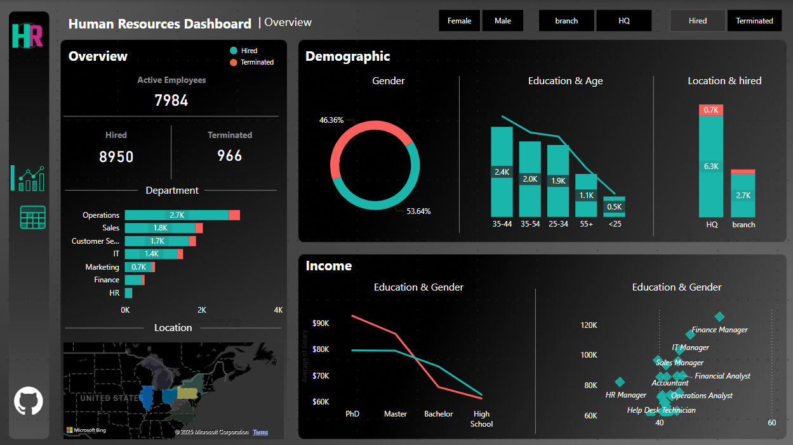

# Hr_dashboard

This dataset simulates a comprehensive set of employee information typically found in HR systems. It includes demographic details (such as age, gender, and ethnicity), job-related information (like roles, departments, and work locations), compensation data (including salary, bonuses, and benefits), performance evaluations (covering ratings, promotions, and achievements), and attrition data (such as reasons for leaving, employee tenure, and exit interviews). This data helps HR professionals analyze workforce trends, performance, and retention."

---

## 📌 Overview
A Power BI dashboard providing actionable insights into workforce dynamics, including hiring trends, attrition risks, compensation analysis, and demographic distribution.ership, and product usage.

---

## 📊 Key Performance Indicators (KPIs)

| KPI                      | Value     | Description |
|--------------------------|-----------|-------------|
| **Total Hired**      | 8,950    | Hired Employees |
| **Active Emp**           | 7984     | Total Active Emp |
| **Terminated emp**       | 966    | Count of Terminated Emp |
| **Rentention Rate**         | 89.21%     | Percentage of Emp working |
| **atteration Rate**          | 10.79%     | Percentage of Terminated Emp |
| **Gender Diversity Ratio** | 645.4     | Average credit score across all customers |
| **Active Credit Score**  | 651.9     | Average credit score among active customers |

---

## Workforce Metrics

| **Category**            | **Metrics**                                |
|-------------------------|--------------------------------------------|
| **Workforce**           | Active Employees: 7,984, Hires: 8,950, Terminations: 966 |
| **Demographics**        | Gender Split: 46.36% Female, 33.64% Male, Age Groups: 35-54 dominant |
| **Compensation**        | PhD Avg. Salary: $149K, Master's Avg.: $125K |
| **Location**            | HQ: 6.3K, Branches: 2.7K                  |
| **Turnover**            | Avg. Tenure of Terminated Employees: 5 years |

## Summary of Insights

- **Hiring Boom**: 8,950 new hires in FY23, but 10.8% attrition rate signals retention risks.
- **Gender Pay Gap**: Female PhDs outearn males in similar roles, but Master's holders show narrower gaps.
- **Tenure & Termination**: Employees leaving after an average of 5 years suggests potential dissatisfaction among mid-career employees.
- **Education Premium**: PhDs earn ~20% more than Master's holders, emphasizing upskilling incentives.
- **HQ Dominance**: 70% of the workforce is based at HQ; branches need more talent development focus.

## Business Problems Identified

- **High Attrition**: 966 terminations (10.8% rate) could indicate cultural, compensation, or growth-related issues.
- **Age Concentration**: 35-54 age group dominates—risks future leadership pipeline gaps.
- **Branch Underrepresentation**: Only 2.7K employees in branches vs. 6.3K at HQ—potential imbalance.
- **Salary Disparities**: Wide salary ranges for similar roles/education levels (e.g., $117K–$153K).

## Recommendations

### Retention Programs:
- Conduct exit interviews to identify drivers of attrition.
- Launch mid-career development programs (targeting employees with ~5 years tenure).
  
### Diversity & Pay Equity:
- Audit salaries by role/gender to ensure fairness.
- Expand recruitment of male candidates in underrepresented areas.
  
### Branch Talent Strategy:
- Incentivize HQ-to-branch transfers with relocation bonuses.
- Localize hiring campaigns for branch roles.

### Upskilling Initiatives:
- Sponsor Master's employees for PhD programs to close salary gaps.
- Offer certifications in in-demand skills (e.g., IT, Finance).

### Succession Planning:
- Mentor younger employees (<35) to prepare them for leadership roles.

 **Data_source** [datawithbaraa]
